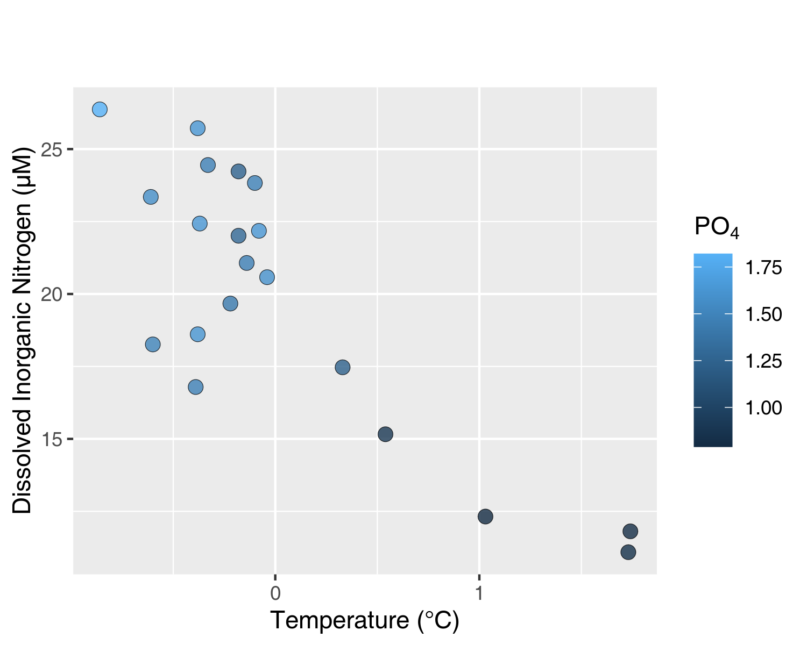
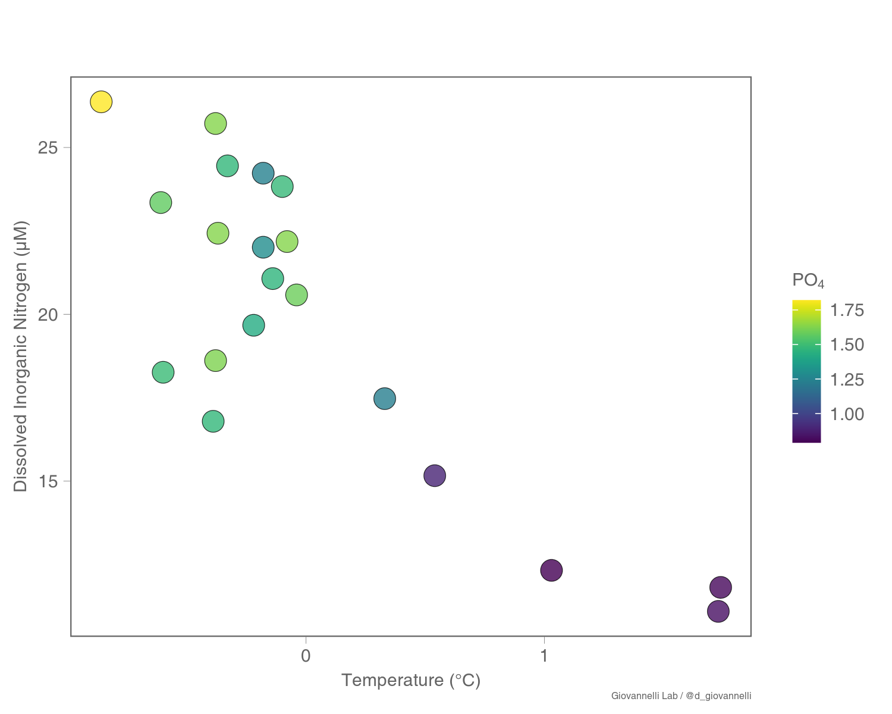

# Giovannelli Lab ggplot2 figure theme

[](https://forthebadge.com)
[](https://forthebadge.com)
[](https://forthebadge.com)

[](http://www.donatogiovannelli.com)
[](https://www.r-project.org)
[](https://github.com/giovannellilab/GLab_ggplot2_theme/graphs/commit-activity)
[](https://zenodo.org/badge/latestdoi/576491778)

Here the short code we use to draw all our figure in the Giovannelli Lab. It was designed following design principles highlited in the [IPCC Visual Style Guide](https://www.ipcc.ch/site/assets/uploads/2019/04/IPCC-visual-style-guide.pdf) and the suggestions found in the great Nature Methods series [Points of View](https://www.nature.com/search?author=Bang%20Wong&order=relevance&journal=nmeth). You can find more information about our laboratory at the lab website [www.donatogiovannelli.com](www.donatogiovannelli.com).

## Design principles
The theme follows the high data-to-ink ratio principles, and plays with salience and the viridis palettes (deafult of the theme) to make sure your data are highlighted in the figure. All unnecessary elements are removed. 

```
theme_glab <- function(base_size = 12,
                    base_family = "",
                    base_line_size = base_size / 180,
                    base_rect_size = base_size / 180) {
    
    font <- "Helvetica" #assign font family up front
    
    theme_bw(base_size = base_size, 
                base_family = base_family,
                base_line_size = base_line_size) %+replace%
    theme(
        legend.background =  element_blank(),
        legend.title =       element_text(color = rgb(100, 100, 100, maxColorValue = 255), 
                                          size = rel(0.65),
                                         hjust = 0),
        legend.text =        element_text(color = rgb(100, 100, 100, maxColorValue = 255),
                                          size = rel(0.65)),
        legend.key.size =    unit(0.8, "lines"),
      
      plot.title = element_text(
        color = rgb(100, 100, 100, maxColorValue = 255), 
        hjust = 0),
        
      axis.title = element_text(
        color = rgb(100, 100, 100, maxColorValue = 255),
        size = rel(0.65)),
      axis.text = element_text(
        color = rgb(100, 100, 100, maxColorValue = 255),
        size = rel(0.65)),
        
      plot.caption = element_text(
        color = rgb(100, 100, 100, maxColorValue = 255),
        size = rel(0.35),
        hjust = 1), 
        
      panel.grid.major = element_blank(),   
      panel.grid.minor = element_blank(),   
      panel.border = element_rect(fill = NA, colour = rgb(100, 100, 100, maxColorValue = 255)),

      
      complete = TRUE
    )
}
```

You can always alter any part of the plot using the [_theme_ options from ggplot2](https://ggplot2.tidyverse.org/reference/theme.html).

```
theme(
  line,
  rect,
  text,
  title,
  aspect.ratio,
  axis.title,
  axis.title.x,
  axis.title.x.top,
  axis.title.x.bottom,
  axis.title.y,
  axis.title.y.left,
  axis.title.y.right,
  axis.text,
  axis.text.x,
  axis.text.x.top,
  axis.text.x.bottom,
  axis.text.y,
  axis.text.y.left,
  axis.text.y.right,
  axis.ticks,
  axis.ticks.x,
  axis.ticks.x.top,
  axis.ticks.x.bottom,
  axis.ticks.y,
  axis.ticks.y.left,
  axis.ticks.y.right,
  axis.ticks.length,
  axis.ticks.length.x,
  axis.ticks.length.x.top,
  axis.ticks.length.x.bottom,
  axis.ticks.length.y,
  axis.ticks.length.y.left,
  axis.ticks.length.y.right,
  axis.line,
  axis.line.x,
  axis.line.x.top,
  axis.line.x.bottom,
  axis.line.y,
  axis.line.y.left,
  axis.line.y.right,
  legend.background,
  legend.margin,
  legend.spacing,
  legend.spacing.x,
  legend.spacing.y,
  legend.key,
  legend.key.size,
  legend.key.height,
  legend.key.width,
  legend.text,
  legend.text.align,
  legend.title,
  legend.title.align,
  legend.position,
  legend.direction,
  legend.justification,
  legend.box,
  legend.box.just,
  legend.box.margin,
  legend.box.background,
  legend.box.spacing,
  panel.background,
  panel.border,
  panel.spacing,
  panel.spacing.x,
  panel.spacing.y,
  panel.grid,
  panel.grid.major,
  panel.grid.minor,
  panel.grid.major.x,
  panel.grid.major.y,
  panel.grid.minor.x,
  panel.grid.minor.y,
  panel.ontop,
  plot.background,
  plot.title,
  plot.title.position,
  plot.subtitle,
  plot.caption,
  plot.caption.position,
  plot.tag,
  plot.tag.position,
  plot.margin,
  strip.background,
  strip.background.x,
  strip.background.y,
  strip.clip,
  strip.placement,
  strip.text,
  strip.text.x,
  strip.text.y,
  strip.switch.pad.grid,
  strip.switch.pad.wrap,
  ...,
  complete = FALSE,
  validate = TRUE
)
```
Below an example of a scatterplot of same geochemical data with the base ggplot2 theme and the glab_theme.




## Credits
If you decide to use this theme, fantastic! If you wanna let us know that you are using it, drop us a line on social media or via email. If you wanna cite this theme, please use:

*Giovannelli, D and the Giovanelli Lab members. 2020. A customized ggplot2 theme for publication ready scientific figures. doi: 10.5281/zenodo.7420645*

Thank you and have fun with your data!
